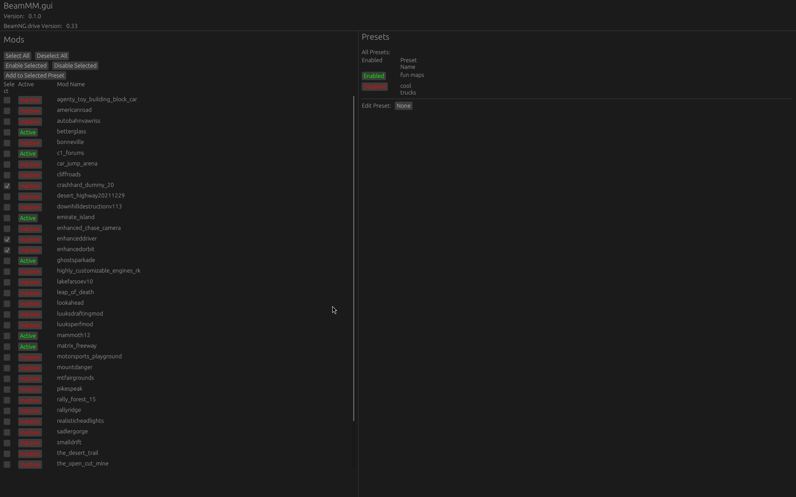

# BeamMM.gui - A WIP Mod Manager for BeamNG.drive

BeamMM.gui is a GUI implementation of [BeamMM](https://github.com/trevin-j/BeamMM), the logic of the mod manager.

## Features

BeamMM.gui implements all but one of the features in BeamMM 0.1.0. 

- Enable/disable mods
- Presets
  - Create/delete presets
  - Add/remove mods from presets
  - Enable/disable preset mods
  - Enable multiple presets at a time

This software is very WIP. Many additional features are planned. These features will first be implemented in the [BeamMM](https://github.com/trevin-j/BeamMM) repository. Notably, the following features are on higher priority and will likely be in the next release:

- Installing mod from zip file
- Uninstalling mods
- Mod metadata (caching and retrieving mod name, filename, version, description, etc.)

## Installation

Download the compiled exe in the releases! No additional software is required to run. It's a portable application and requires no install.

### Build

Clone this repo and run `cargo build --release`.

## Usage

Launch the program! The UI should be reasonably easy to understand. I'm not a UI dev by any means, so any help or suggestions for improvement are welcome.

## Contributing

Well... I appreciate the enthusiasm and desire to help but the code is currently pretty messy. It needs refactoring and some redesigns. A couple areas are even messier because of some lost battles against the borrow checker. And I'm still trying to figure out [egui](https://github.com/emilk/egui) and [eframe](https://github.com/emilk/egui/tree/master/crates/eframe). I swear I've never run into as many borrow checker issues as when trying to work with these libraries. But I'm still new to them.

All that said, if you really desire to help, it's always welcome, and I'll look at any pull requests. This repository is mainly front-end GUI code. If you want to add/remove/change anything with the logic you will want to check out the other [BeamMM](https://github.com/trevin-j/BeamMM) repo.
